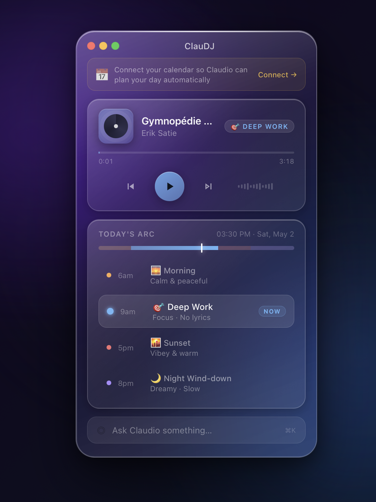

# ClauDJ

> Personal AI Radio · From Preference Modeling → Planning → DJ-style Playback

## Pipeline

### Layer 1 — User-facing I/O
Four data sources feed the system: your **User Profile** (taste.md, routines.md, playlists.json, mood-rules.md), the **ClauDJ Brain** (Claude via Max subscription, invoked as `claudj -p --output json`), **NeteaseCloudMusicApi** for music search/retrieval/lyrics/recommendations, and a **Voice/IO** layer combining Fish TTS, Feishu (Lark), weather, and UPnP room control.

### Layer 2 — Core Logic
Six modules handle the heavy lifting:
- **router.js** — routes simple commands, NLP, and music requests to the right handler
- **context.js** — assembles the system prompt from taste + routines + environment + history
- **claudj.js** — spawns the Claude process and parses its structured output `{say, play[], reason, segue}`
- **scheduler.js** — drives 07:00 planning, 09:00 morning review, periodic replanning, and calendar hooks
- **tts.js** — converts speech to cached MP3s via Fish Audio
- **state.db** — SQLite persistence for messages, plays, plan, and preferences

### Layer 3 — Runtime Orchestration
Before every Claude response, a context window is assembled from 6 fragments: System Prompt → User Profile → Environment (weather/calendar/time) → Execution State → User Input/Tool Results → Execution Traces. Claude outputs `{say, play[], reason, segue}` which gets queued to NCM, synthesized to TTS, and pushed via WebSocket as `now-playing`.

### Layer 4 — Interfaces & Endpoints
A **PWA on localhost:8080** handles playback visualization with a single `<audio>` element, real-time WebSocket updates, and 10s prefetch. It talks to the server via **6 APIs**: `POST /api/chat`, `GET /api/now`, `GET /api/next`, `GET /api/taste`, `GET /api/plan/today`, and `WS /stream`.
